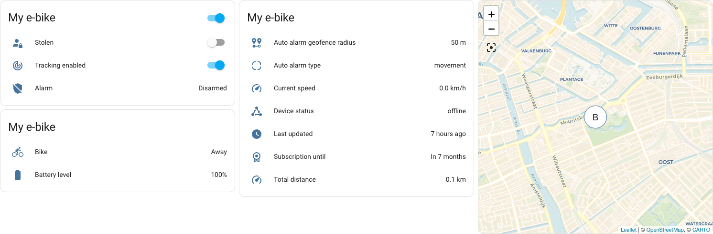

# Home Assistant BikeTrax
Custom component for the PowUnity BikeTrax integration for Home Assistant.

## Introduction
This custom components adds support for the
[PowUnity BikeTrax](https://powunity.com/) GPS tracker.

## Features
* Multi-device support
* Live updates
* Ability to control alarm, tracking and stolen-state.

## Installation

### HACS
This is the preferred method of installation.

- Search for this integration and install it.
- Restart Home Assistant.

### Manual
- Download the contents of this repository.
- Copy the `custom_components` folder to your configuration folder. If you
  already have one, then merge its contents.
- Restart Home Assistant.

### Configuration

- Add a new integration using the web interface, and follow the configuration
  steps.

  
  
## Known issues
When read-only mode is enabled, the switches do not reflect this mode properly.
If you try to toggle a switch, it will eventually restore to its actual state.

I do not really know how to handle this properly, without changing the entity
type.

## References
This custom component builds on top of
[aiobiketrax](https://github.com/basilfx/aiobiketrax).

## Contributing
See the [`CONTRIBUTING.md`](CONTRIBUTING.md) file.

## License
See the [`LICENSE.md`](LICENSE.md) file (MIT license).

## Disclaimer
Use this library at your own risk. I cannot be held responsible for any
damages.

This page and its content is not affiliated with PowUnity.
